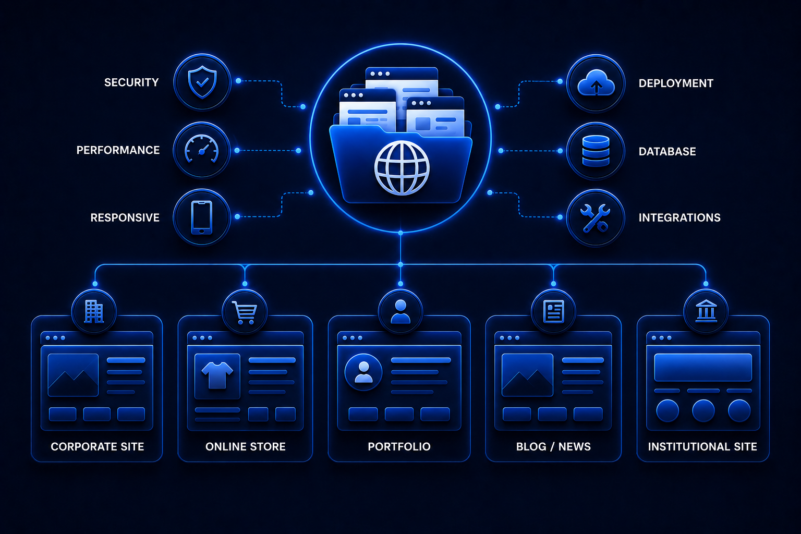
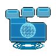
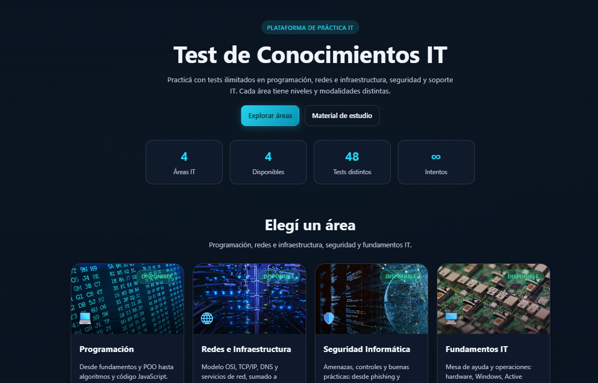
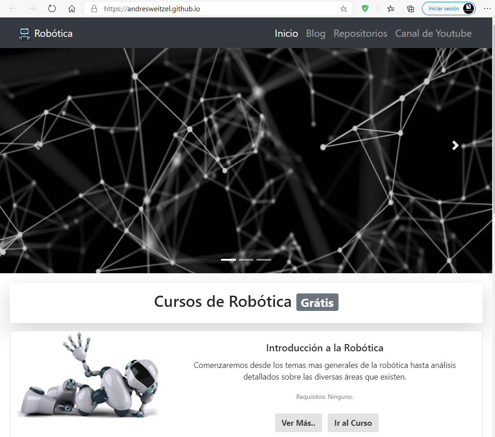

<!--PAGINAS WEB-->

 

     
    

##   Websites

 

Central repository for website projects focused on responsive design, usability, and frontend development practices.

 

 * Languages : HTML, CSS, JavaScript, others.
 * Frameworks : Bootstrap, others.
 * Tools : VS Code, Git, Heroku, Netlify, others.

  
 
  

<!------Start Index----->

## Index 📜

 
 See 

  

#### 🗂️ Projects

* [IT Test — IT Knowledge Test Platform ](#it-test--it-knowledge-test-platform)

  

    
    
    
    
    
    
    
  

* [Robotics Website ](#robotics-website)

  

    
    
    
    
    
  

 

<!------Stop Index----->
  
 
  

    
 ## 🗂️ Projects

 

<!------START IT_Test_Knowledge_Platform------>

  

### IT Test — IT Knowledge Test Platform  [🔝](#index)

  

  

    
    
    
    
    
    
    
  

 

 ### Details

  

   
<!------END IT_Test_Knowledge_Platform------->

 
 
  
 
  
 

<!------START Robotics_Website------>

  

### Robotics Website  [🔝](#index)

  

  

    
    
    
    
    
  

 

 ### Details

  

   
<!------END Robotics_Website------->

 
 
 
 
 
 

<!--FIN PAGINAS WEB-->
